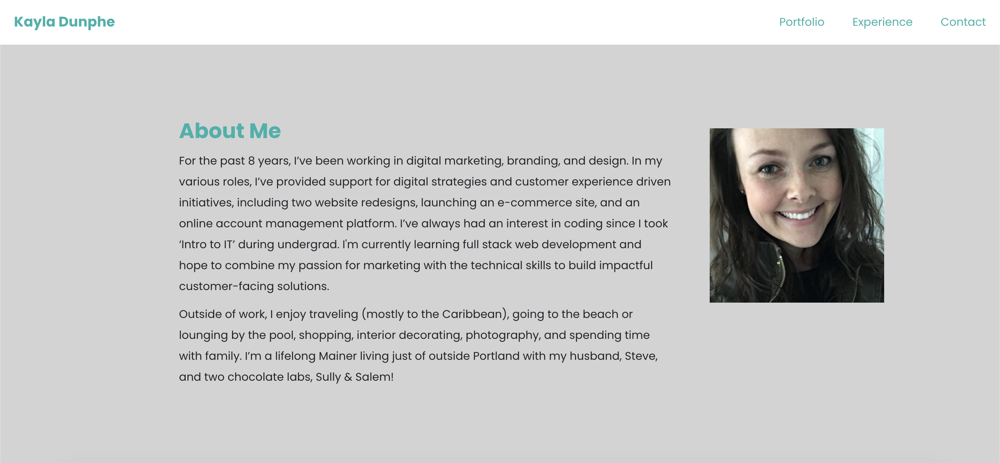

# React Portfolio

<h2>Overview</h2>

**Deployed Site:** https://kdunphe.github.io/react-portfolio/

**Technologies Used:** React, HTML, CSS, JavaScript, jQuery, Bootstrap, Flex Box

**Contact:** <a href="mailto:kayla.dunphe@gmail.com">kayla.dunphe@gmail.com</a>

**Goal:** Create a portfolio using React.js featuring my most recent work demonstrating the technologies learned in the coding bootcamp.

<h2>Screenshots</h2>

